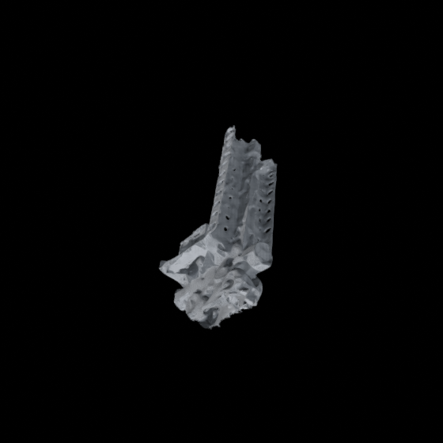
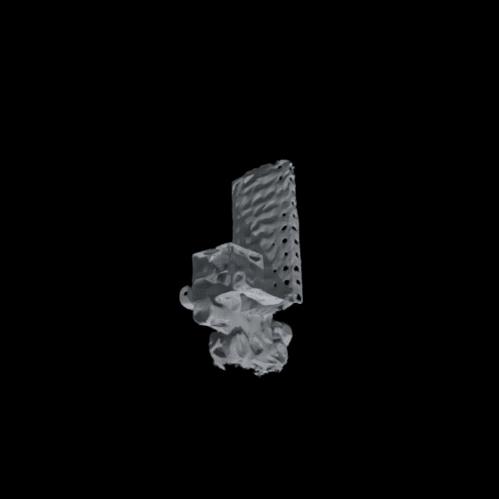
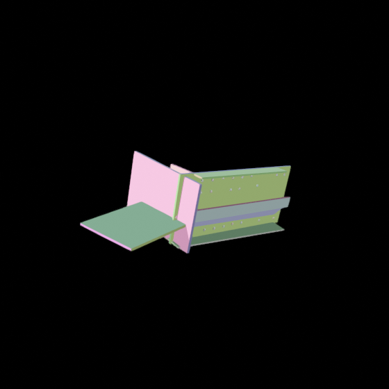
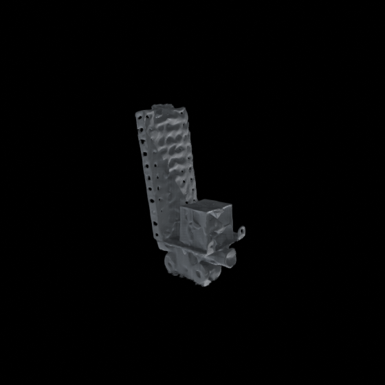
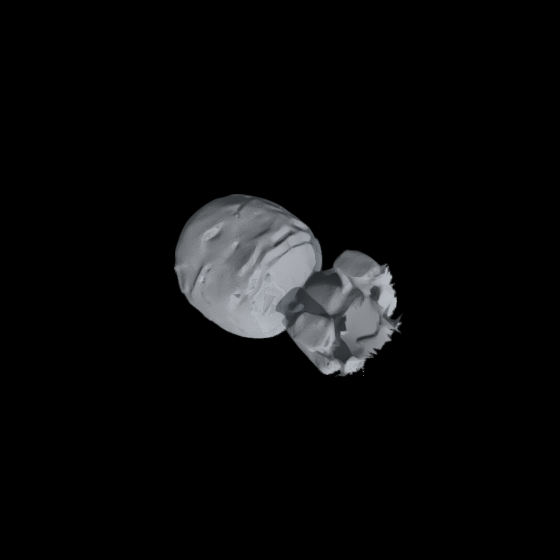
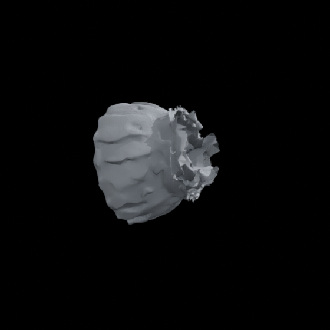
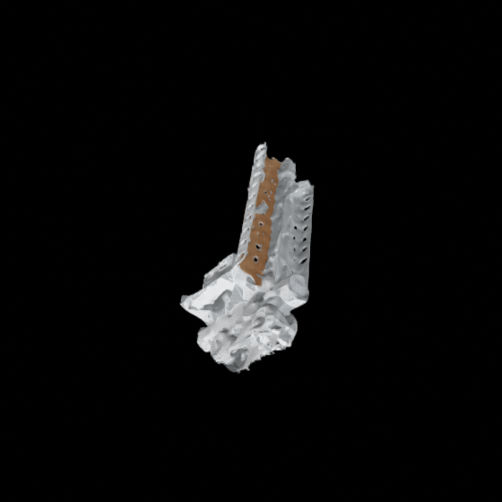
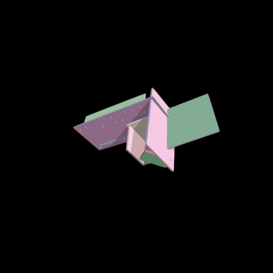
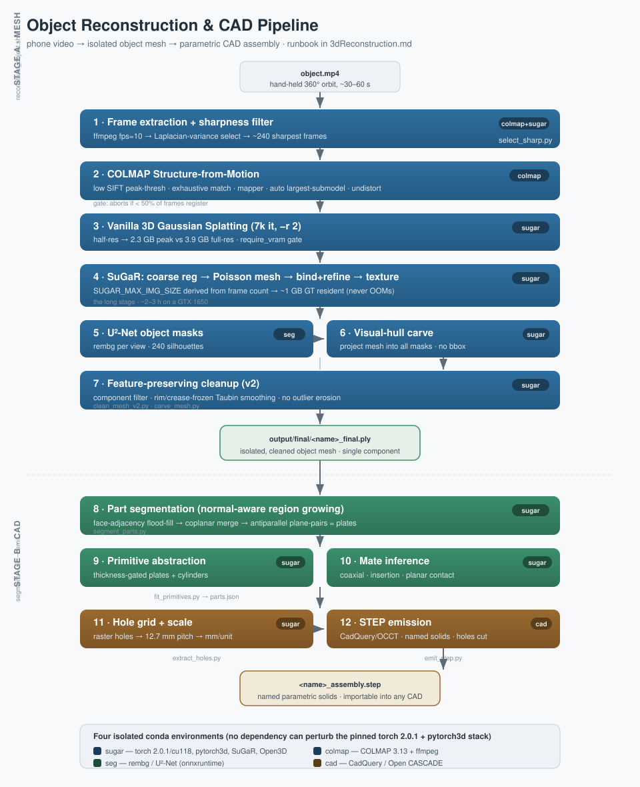

<div align="center">

#  SuGaRrush: 3D Object Reconstruction 

<font size="4">
COLMAP&nbsp;→&nbsp;3DGS&nbsp;→&nbsp;SuGaR&nbsp;→&nbsp;visual-hull&nbsp;carve&nbsp;→&nbsp;primitive&nbsp;fitting&nbsp;→&nbsp;STEP
</font>


<br>
<b>A hand-held phone video of a toy forklift (left, centre) becomes an isolated triangle mesh,<br>
then a parametric CAD assembly of named, perforated plates (right) — every surface fit to the real images.</b>

</div>

## Abstract

_This repository extends [SuGaR](./README.md) into a complete, reproducible pipeline that turns a
single hand-held phone video of an object into (a) a clean, isolated triangle mesh and (b) a
parametric CAD assembly of the object's constituent parts. It is **observation-only**: nothing is
generatively hallucinated, and any part that cannot be fit from the data is reported as such rather
than invented._

_The work is grounded in a specific, hostile constraint — a **4 GB GTX 1650** under WSL2 — which
forces every stage to be memory-disciplined. The headline engineering result is that the entire
pipeline runs end-to-end at this budget without ever exceeding VRAM, by **deriving** the SuGaR
image-resolution cap from the frame count instead of fixing it. On top of the mesh, a
second stage lifts the surface into engineering primitives: it segments the object into
normal-coherent plates and cylinders, gates plate candidates by a modal sheet thickness, recovers
the perforation grid, derives absolute metric scale from the Meccano 12.7 mm hole pitch, infers
mates between parts, and emits a STEP assembly importable into any CAD package._

## Results at a glance

<div align="center">

| | object1 (forklift) | object2 (figure) | object3 (glass bowl) |
|:--|:--:|:--:|:--:|
| surface | matte plastic + perforated metal | glossy painted | **transparent glass** |
| capture | 36 s, 240 sharp frames | 56 s, 240 sharp frames | 31 s, 240 sharp frames |
| COLMAP registration | 239 / 240 | **240 / 240** | **240 / 240** |
| vanilla 3DGS PSNR | 30.03 | 31.85 | 31.87 |
| final mesh | **50,772** tris, 99% one comp. | 10,124 tris, 99% one comp. | 22,717 tris, 99% one comp. |
| outcome | full detail | head clean, body rough | fluted exterior only |
| CAD parts emitted | 11 named solids + 23 holes | — (organic) | — (transparent) |
| derived metric scale | **101.2 mm / unit** (hole pitch) | — | — |

The three runs bracket the material-difficulty range and show its ceiling: **every capture-quality
metric (sharpness, PSNR, registration) is actually highest on the two hardest objects**, yet the
matte, textured forklift is the only one that reconstructs in full. Diffuse and textured surfaces
work; glossy struggles; transparent recovers only its opaque, frosted regions. This is material
physics, not a tunable — all three ran unattended, back to back, with zero failures and no OOM.




<br>
<b>The three test objects</b>, left → right: matte forklift (full detail) · glossy figure
(head clean, body rough) · transparent glass bowl (fluted exterior only).
<br><br>



<br>
<b>Stage B on the forklift:</b> normal-coherent surface segmentation → parametric CAD plates
with recovered perforations.

</div>

## Architecture

The pipeline is two stages. **Stage A** (`scripts/reconstruct_object.sh`) is one command that takes
a video to an isolated mesh. **Stage B** turns that mesh into a CAD assembly. Both span four
isolated conda environments so that no stage's dependencies can perturb the pinned
`torch 2.0.1 + pytorch3d 0.7.4` stack that SuGaR requires.

<div align="center">

</div>

## Overview — the design decisions that matter

This section states the non-obvious choices and *why* they are made.

**Run COLMAP on full frames, isolate the object afterwards.** A walk-around capture relies on
background parallax for pose; masking the object before SfM starves COLMAP of correspondences.
Isolation happens *after* poses exist, by carving with masks (Stage A step 6), never by a bounding
box — a hand-tuned box silently amputated 41% of the first object.

**The VRAM guarantee is a derivation, not a constant.** SuGaR keeps every ground-truth image
resident on the GPU, so its footprint is `n · w · h · 3 · 4` bytes — *linear in frame count*. A cap
that fits 240 frames OOMs at 400. The script solves a byte budget for the image side length given
the frame count, holding the GT footprint flat at ~1 GB from 150 to 600 frames.

**Carve against the images, denoise against topology.** The object is isolated by projecting the
full scene mesh into every U²-Net silhouette and keeping triangles that land inside the object
across the views that see them (visual hull). Cleanup then uses topology-aware operations only —
component filtering and *rim/crease-frozen* smoothing — because the standard point-cloud recipe
(statistical outlier removal, isotropic smoothing) erodes exactly the thin plates and perforation
rims that matter.

**Fit primitives bottom-up; verify, never guess.** Stage B does not assume a catalogue of parts.
It grows normal-coherent surface patches, pairs antiparallel planes into plates, gates them by a
modal sheet thickness (rejecting spurious cross-object pairings), and only accepts a cylinder when
its surface normals wrap enough of the axis — a test that correctly refuses to emit the pipe and
wheels, which the orbit never observed from enough angles.

**Metric scale from a periodic feature beats a measurement.** Meccano holes sit on a fixed 12.7 mm
grid. Detecting the modal hole spacing yields absolute scale with no ruler — and corrected an
eyeballed guess that was 40% too large.

## Stage A — video to isolated mesh

One command. Runs detached; every stage writes a `.done_<stage>` marker so a re-run resumes.

```bash
cd SuGaR
nohup bash scripts/reconstruct_object.sh \
    --video inputs/object2.mp4 --name object2 \
    > scenes/object2_run.log 2>&1 &
tail -f scenes/object2_run.log
```

| Step | Script / tool | Env | Output |
| :-- | :-- | :--: | :-- |
| 1 · frames | `select_sharp.py` (ffmpeg + Laplacian) | colmap→sugar | `<scene>/input/` ~240 frames |
| 2 · SfM | COLMAP (patched `convert.py` flags) | colmap | `<scene>/sparse/0/` poses |
| 3 · 3DGS | `gaussian_splatting/train.py -r 2` | sugar | `output/vanilla_gs/<name>/` |
| 4 · SuGaR | `train_full_pipeline.py` | sugar | `output/refined_mesh/<name>/*.obj` |
| 5 · masks | `rembg` U²-Net | seg | `<scene>/masks/` |
| 6 · carve | `carve_mesh.py` | sugar | `output/final/<name>_carved.ply` |
| 7 · clean | `clean_mesh_v2.py` | sugar | **`output/final/<name>_final.ply`** |
| 8 · texture *(opt-in `--texture`)* | `bake_texture.py` | sugar | `output/final/<name>_textured.glb` (+ `_texture.png`, `_textured_obj/`) |

Key options (all have working defaults):

| Flag | Default | Meaning |
| :--: | :--: | :-- |
| `--video` | — | input video (required) |
| `--name` | video basename | scene name under `scenes/` |
| `--fps` | `10` | frame extraction rate before sharpness filtering |
| `--target` | `240` | number of sharp frames to keep |
| `--refine` | `short` | SuGaR refinement: `short` / `medium` / `long` |
| `--vertices` | `500000` | mesh resolution (foreground vertices) |
| `--keep-ratio` | `0.85` | carve: fraction of observing views that must see a vertex inside the mask |
| `--texture` | off | bake an observation-only texture atlas from the source frames (Stage 8) |
| `--atlas` | `2048` | texture atlas side (with `--texture`) |
| `--tex-views` | `24` | per-texel top-K observations kept for the weighted-median blend |
| `--force` | off | ignore `.done` markers and recompute |

### Texture bake (Stage 8, `--texture`)

`bake_texture.py` projects the source frames onto the final mesh and blends with a **weighted
median** — a mean would smear a specular highlight (seen in only a few of the ~50 views per texel)
into a ghost across the surface; the median rejects it, giving a partial de-lighting. It unwraps
with `xatlas`, rasterizes the atlas in UV space (nvdiffrast), then per camera rejects occluded
texels (depth z-test), out-of-mask texels, and grazing views (`|dot(n,v)| < 0.2`), keeping the top
K observations per texel. Coverage (the unobserved fraction) is reported in `<name>_texbake.json`.
Correctness is checked by re-rendering the baked mesh vs GT inside the mask (`--validate`).

Texture-side mirror of the H1 SDF A/B — same frames, only the SDF budget differs:

| | object4 · **50k** SDF | object5 · **300k** SDF |
| :-- | :--: | :--: |
| coverage | **97.59 %** | 96.32 % |
| in-mask PSNR | **18.33 dB** | 18.29 dB |

The 50k-SDF mesh textures as well as the 6×-costlier 300k mesh — independent evidence that H1 did
not degrade the surface. Outputs are additive; the geometry `.ply` and the CAD/STEP path are untouched.

## Stage B — mesh to CAD assembly

Run after Stage A. Segmentation and fitting run in `sugar`; STEP emission runs in `cad`
(CadQuery/OCCT), with `parts.json` as the interface between them.

```bash
conda activate sugar
python scripts/fit_primitives.py --mesh output/final/object1_final.ply --out output/final/parts.json
python scripts/extract_holes.py  --mesh output/final/object1_final.ply --parts output/final/parts.json \
       --part plate_0 --out output/final/holes.json

conda activate cad
python scripts/emit_step.py --parts output/final/parts.json --holes output/final/holes.json \
       --out output/final/object1_assembly.step \
       --scale $(python -c "import json;print(json.load(open('output/final/holes.json'))['mm_per_unit'])")
```

| Script | Env | Role |
| :-- | :--: | :-- |
| `segment_parts.py` | sugar | normal-aware region growing → coplanar merge → plane-pair plates |
| `fit_primitives.py` | sugar | thickness-gated plates + coverage-gated cylinders + mate inference → `parts.json` |
| `extract_holes.py` | sugar | raster hole detection → grid pitch → metric scale → `holes.json` |
| `emit_step.py` | cad | CadQuery solids, perforations cut, named parts → `.step` |

### What Stage B recovered on object1

| Fitted part | Dimensions | Physical part |
| :-- | :-- | :-- |
| `plate_0` | 72 × 162 × 2.2 mm, 23 holes | perforated **mast sheet** |
| `plate_2` | up-facing | **cargo shelf** |
| `plate_3`, `plate_4` | long thin strips | **U-bars** |

Independent sanity checks that the scale is right: detected hole diameter **3.42 mm** (real Meccano
≈ 4 mm) and plate dimensions falling on near-whole 12.7 mm pitch counts. The emitted STEP
round-trips through Open CASCADE as 11 solids, the perforated plate carrying 29 B-rep faces
(6 box + 23 hole cylinders).

## Outputs

```
scenes/<name>/
  input/            sharpness-filtered frames
  images/           undistorted images (COLMAP)
  sparse/0/         COLMAP poses + sparse cloud
  masks/            U²-Net object silhouettes
  logs/             per-stage logs
  .done_*           resume markers

SuGaR/output/
  vanilla_gs/<name>/                7k-iter 3DGS checkpoint
  refined_mesh/<name>/*.obj + .png  SuGaR textured mesh (whole scene)
  final/
    <name>_carved.ply               object after visual-hull carve
    <name>_final.ply    ★           isolated, cleaned object mesh  ← Stage A deliverable
    parts.json                      fitted primitives + mates
    holes.json                      perforation grid + metric scale
    <name>_assembly.step  ★         parametric CAD assembly       ← Stage B deliverable
```

## Honest limitations

This pipeline reports its own confidence; these are the measured ceilings, not aspirations.

- **Glossy / dark rounded surfaces do not reconstruct**, regardless of frame sharpness or PSNR.
  object1's matte perforated mast came out crisp; its dark chassis and object2's shiny body came out
  rough. This is capture physics — diffuse, textured, matte subjects are the ones that work.
- **Cylinders are not recovered** from a single-height orbit: a barrel is seen from &lt; 50% of angles,
  below the coverage threshold, so the pipe and wheels are deliberately *not* emitted rather than
  faked.
- **Thin plates thicken.** Photogrammetry inflates a ~1 mm sheet to ~2 mm; fitted thickness is an
  upper bound, overridable with known stock.
- **Meshes are open surfaces, not solids** — direct mesh→B-rep is not attempted; Stage B fits
  parametric parts instead.

## Environments

Created once, reused by every run. See [`SETUP_NOTES.md`](../SETUP_NOTES.md) for the full record,
including the two failure modes that masquerade as memory errors.

| Env | Purpose | Key pins |
| :--: | :-- | :-- |
| `sugar` | reconstruction + geometry | python 3.9, torch 2.0.1/cu118, pytorch3d 0.7.4, Open3D, `TORCH_CUDA_ARCH_LIST=7.5+PTX` |
| `colmap` | SfM + video | COLMAP 3.13 (CUDA), ffmpeg |
| `seg` | object masks | rembg / U²-Net (onnxruntime) |
| `cad` | STEP emission | CadQuery / Open CASCADE |

## Script reference

| Script | One-line purpose |
| :-- | :-- |
| `reconstruct_object.sh` | end-to-end video → isolated mesh (Stage A) |
| `select_sharp.py` | keep the sharpest frame per sliding window |
| `carve_mesh.py` | visual-hull isolation of the object using multi-view masks |
| `clean_mesh_v2.py` | feature-preserving cleanup (rim/crease-frozen smoothing) |
| `segment_parts.py` | normal-aware segmentation into plates |
| `fit_primitives.py` | primitive fitting + mate inference → `parts.json` |
| `extract_holes.py` | perforation grid + metric scale → `holes.json` |
| `emit_step.py` | CadQuery STEP assembly emission |
| `view_ply.py` | type-aware `.ply` viewer (Gaussian cloud vs mesh) |
| `clean_mesh.py` | v1 cleanup (superseded by v2; kept for reference) |

---

<div align="center">
Built on top of <a href="./README.md">SuGaR (Guédon &amp; Lepetit, CVPR 2024)</a>.
Reconstruction pipeline, CAD stage, and hardware-budget engineering documented in
<a href="../3dReconstruction.md">3dReconstruction.md</a>.
</div>
