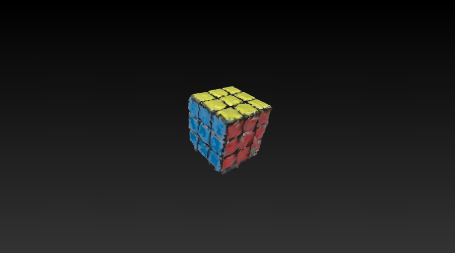
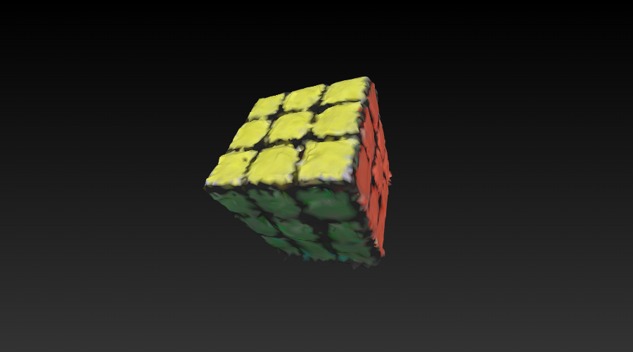
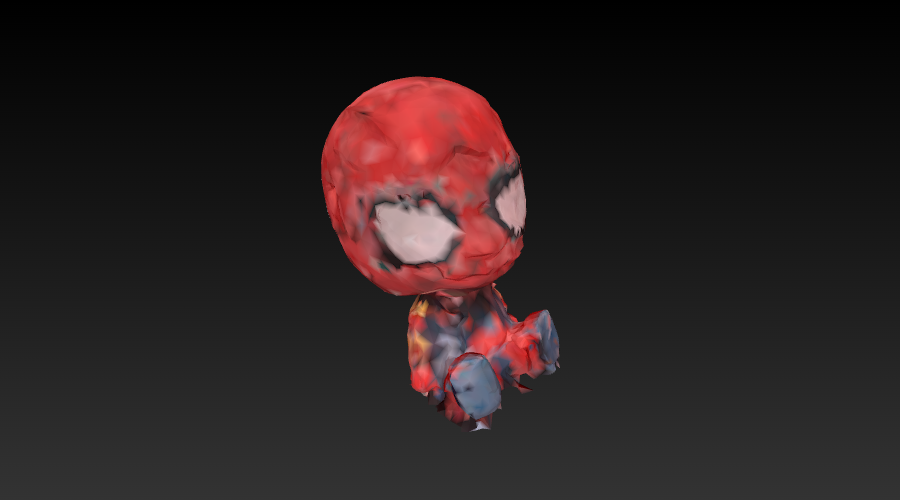
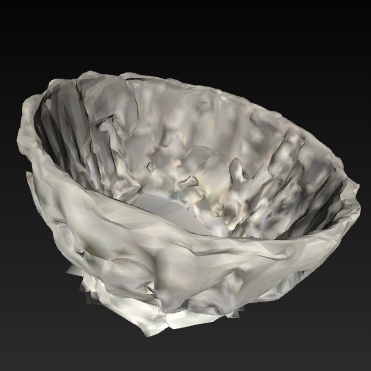
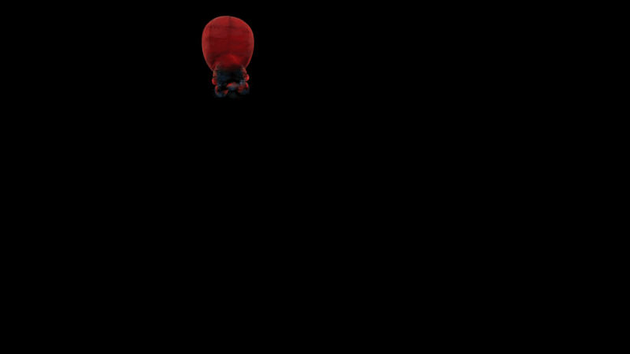
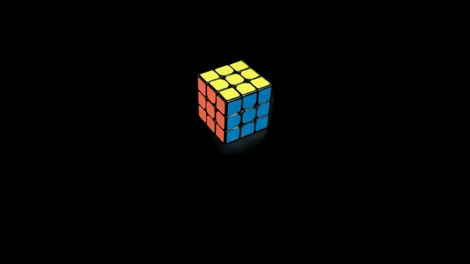
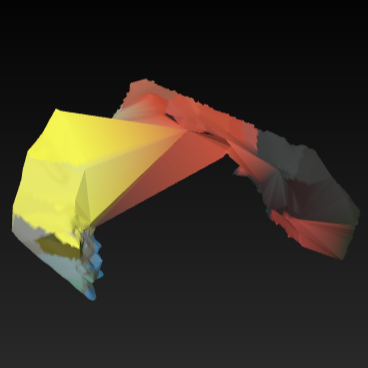
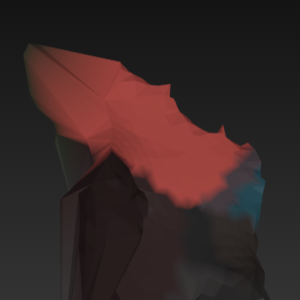

<div align="center">

# SuGaRrush

### Fast SuGaR for object reconstruction

<font size="4">
video&nbsp;→&nbsp;COLMAP&nbsp;→&nbsp;3DGS&nbsp;→&nbsp;<b>masked SuGaR</b>&nbsp;→&nbsp;ρ-filter&nbsp;→&nbsp;hull completion&nbsp;→&nbsp;watertight solid&nbsp;→&nbsp;texture&nbsp;·&nbsp;collision
</font>




<b>A hand-held phone video (left) becomes a Gaussian-splat scene (centre), then an isolated,<br>
watertight, textured mesh of the object alone (right) — on a 4 GB GTX 1650.</b>

</div>

---

## Abstract

_SuGaRrush turns a single hand-held phone video of an object into a **watertight, textured,
physics-ready mesh**. It extends [SuGaR](https://github.com/Anttwo/SuGaR) (Guédon & Lepetit,
CVPR 2024) with two contributions that give the project its name — **making SuGaR fast enough,
and focused enough, to reconstruct one object rather than a whole scene**:_

1. **Masked SuGaR Modelling** — the object is isolated in *Gaussian space* before surface
   optimization, and SuGaR is then trained under a mask-restricted, area-normalized, focal-cropped
   objective. Naively pruning Gaussians fails badly (SuGaR re-optimizes its input and the object
   smears across the scene); the fixes that make it work are the substance of Part I.
2. **SDF-regularization optimization** — the phase that consumed **92 % of a 10.2 h pipeline** is
   memory-bandwidth bound and linear in a hard-coded Monte-Carlo sample count. Cutting it 20×
   (1,000,000 → 50,000), made safe by error-guided sampling, leaves the final mesh agreeing to
   **0.31 % of its own bounding-box diagonal**. Part II is the profiling → hypothesis → validation
   arc.

_Everything is **observation-only**: no generative prior, no learned completion. Geometry no camera
saw is either reported as unobserved or filled from the **visual hull**, which is a deterministic
function of the silhouettes and therefore adds nothing the cameras did not supply._

_The whole thing is developed against a deliberately hostile budget — a **4 GB GTX 1650 with 7.7 GB
of system RAM under WSL2** — which is why the VRAM ceiling is *derived* from frame count rather than
fixed, and why the mesh-extraction depth is *measured* rather than assumed._

---

## Results at a glance

| | **object4** Rubik's cube | **object6** bobblehead | **object7** Meccano forklift | **object3** glass bowl |
|:--|:--:|:--:|:--:|:--:|
| surface | matte, high-texture | glossy painted | metal + foam, **thin & perforated** | **transparent** |
| frames kept | 500 | 236 | 400 | 240 |
| COLMAP registration | 499 / 500 | 236 / 236 | **400 / 400** | **240 / 240** |
| vanilla 3DGS PSNR | 29.95 dB | 30.18 dB | 30.52 dB | 31.87 dB |
| isolation path | masked SuGaR | masked SuGaR | masked SuGaR | carve |
| final mesh | 101,096 tris | 116,240 tris | 127,696 tris | 16,308 tris |
| topology | **euler 2 · genus 0** | **euler 2 · genus 0** | euler −40 | euler −16 · genus 9 |
| texture coverage | 77.46 % | **90.29 %** | 63.98 % | 89.42 % |
| **texture PSNR** | 18.77 dB | **24.02 dB** | 14.98 dB | 18.42 dB |
| outcome | full detail | full detail | masts lost at closure | fluted exterior only |

**Capture quality is not the predictor of success.** Every capture metric — sharpness, 3DGS PSNR,
registration — is *highest* on the two hardest subjects (glass bowl, forklift), yet those are the two
that fail. Diffuse and textured surfaces reconstruct; glossy struggles; transparent recovers only its
opaque frosted regions; **thin spindly geometry survives meshing but is destroyed by hull
completion** (see [Limitations](#honest-limitations)). This is material and geometric physics, not a
tunable.

<div align="center">



<br>
<b>Left → right:</b> matte Rubik's cube (full detail) · glossy bobblehead (clean) ·
transparent glass bowl (opaque regions only).
</div>

---

## The pipeline

One command, twelve stages, four conda environments. Every stage writes a `.done_<stage>` marker, so
a re-run resumes from where it stopped rather than recomputing.

| # | Stage | Script / tool | Env | Output |
|:--:|:--|:--|:--:|:--|
| 1 | frames | `select_sharp.py` (ffmpeg + Laplacian) | colmap → sugar | `<scene>/input/` |
| 2 | SfM | COLMAP (exhaustive) | colmap | `<scene>/sparse/0/` poses |
| 3 | 3DGS | `gaussian_splatting/train.py -r 2` | sugar | `output/vanilla_gs/<name>/` |
| 4 | masks | `rembg` U²-Net | seg | `<scene>/masks/` |
| **5** | **Gaussian prune** | **`prune_gaussians.py`** | sugar | `output/pruned_gs/<name>/` |
| **6** | **masked SuGaR** | **`train_full_pipeline.py` + `mask_loss.py`** | sugar | `output/refined_mesh/<name>/*.obj` |
| **7** | **observation confidence (ρ)** | **`observation_confidence.py`** | sugar | `<name>_rhofilt.ply` |
| **7b** | **visual-hull completion** | **`hull_complete.py`** | sugar | `<name>_hullcomp.ply` |
| 8 | cleanup | `clean_mesh_v2.py` | sugar | *(skipped after 7b)* |
| 9 | watertight | `close_mesh.py` (pymeshfix) | sugar | **`output/final/<name>_final.ply`** |
| 9b | TV-normal flatten *(opt-in)* | `tv_normal_patch.py` | sugar | flattened patch |
| 10 | vertex colour | `color_from_gaussians.py` | sugar | per-vertex RGB on `_final.ply` |
| 11 | texture *(opt-in)* | `bake_texture.py` | sugar | `output/final/<name>/visual/` |
| 12 | collision *(opt-in)* | `make_collision.py` (CoACD) | sugar | `output/final/<name>/collision/` |

Stages **5–7b in bold** are this project's additions and are documented below. Stage 7 has an
alternative for the default path: when `--gaussian-prune` is *off*, isolation happens in mesh space
via `carve_mesh.py` instead.

### Measured wall-clock — object7, 400 frames, from scratch

| Stage | Time | Share |
|:--|--:|--:|
| 1 · frames (1,169 extracted → 400 kept) | 0:32 | 0.3 % |
| 2 · COLMAP SfM | 25:36 | 12.1 % |
| **3 · vanilla 3DGS** | **2:25:51** | **69.2 %** |
| 4 · U²-Net masks | 4:25 | 2.1 % |
| 5 · Gaussian prune | 0:28 | 0.2 % |
| **6 · masked SuGaR** (coarse + Poisson + long refine) | **22:07** | **10.5 %** |
| 7 · ρ filter | 0:08 | 0.1 % |
| 7b · hull completion | 5:38 | 2.7 % |
| 9 · watertight closure | 1:19 | 0.6 % |
| 10 · vertex colour | 0:04 | — |
| 11 · texture bake | 1:44 | 0.8 % |
| 12 · CoACD collision | 2:00 | 0.9 % |
| **Total** | **3:30:53** | |

**This profile is the point of Part II.** Before the SDF optimization, SuGaR was 92 % of wall-clock
and the pipeline took over 10 hours. It is now 10.5 %, and **vanilla 3DGS is the new dominant cost** —
the honest next target.

---

# Part I — Masked SuGaR Modelling

The default SuGaR reconstructs the *whole scene*, and the object is cut out afterwards. That works,
but it spends the entire mesh budget on floor and background, and the object inherits whatever
resolution is left. Masked SuGaR instead isolates the object **before** surface optimization, so the
full budget lands on the subject.

<div align="center">


<br>
<b>Stage 5 output:</b> the trained Gaussian scene reduced to the object alone — 4.7 % of the
Gaussians survive, and the scene extent collapses by 40–70×.
</div>

### Why this is not simply "prune, then train"

Pruning the Gaussians and handing them to stock SuGaR **fails catastrophically**, and the failure is
instructive: SuGaR *re-optimizes its input Gaussians* against the ground-truth images
(`train.py` → `coarse_density.py`, `learnable_positions=True`). With the background Gaussians deleted
but the background still present in the GT images, the photometric loss drags the surviving object
Gaussians outward to explain pixels they cannot represent.

Measured on object4: input extent ~1 unit → **mesh extent ~22 units**, PCA shape ratio
[1, 0.22, 0.13], texture PSNR **8.6 dB** — garbage.

<div align="center">


<br>
<b>The overflow failure.</b> A pruned Rubik's cube, re-optimized under an unmasked loss: the
Gaussians stretch into depth spikes ("the hook") chasing background they can no longer represent.
</div>

Four mechanisms, applied together, are what make masked training actually work.

### 1 · The prune — two ordered admissibility tests

`prune_gaussians.py` decides which Gaussians are the object. It applies **two tests that target
disjoint failure modes**, and the order matters:

| test | question it asks | what it removes |
|:--|:--|:--|
| **agreement** `n_in / n_frust ≥ 0.6` | of the cameras that looked, did they call it object? | floor, table, backdrop |
| **support** `n_frust ≥ σ·N` | was this location interrogated at all? | distant floaters |

Neither subsumes the other. The table under the object has *full* support and fails agreement; a
floater seven object-diagonals away has *high* agreement and fails support — because `n_frust` counts
only views where the centre lands inside the image rectangle, so a distant point is judged by the
handful of cameras that happened to frame it. On object6 that let 477 centres survive at agreement
**0.604**, clearing the 0.60 threshold by 0.004.

**σ is measured, not chosen.** Frame support is bimodal for an orbit capture — the operator keeps the
subject framed, so background drifts out of frame as the camera swings — and `calibrate_support()`
cuts in the widest *empty* band of the support histogram:

```
object7, 400 views, support histogram (agreement-passing Gaussians only)

  0.00–0.05      31                                              ← junk
  0.10–0.15   1,452  ##                                          ← junk
  0.15–0.90       0                                              ← empty: 75 % of the range
  0.90–0.95     692  #                                           ← object
  0.95–1.00  33,896  ##############################################  ← object
```

| | object6 | object7 |
|:--|:--:|:--:|
| Gaussians in | 541,096 | 681,857 |
| kept | 25,226 (4.7 %) | 34,588 (5.1 %) |
| empty band → σ | 0.240–0.660 → **0.450** | 0.150–0.850 → **0.500** |
| junk removed | 477 | 1,483 |
| object geometry lost | **0** | **0** |
| extent before | [94.3, 48.7, 97.1] | [74.3, 51.8, 65.5] |
| extent after | **[0.88, 1.47, 0.90]** | **[0.64, 1.10, 0.93]** |

The gap is *structural*, not a lucky threshold — it reproduces across two unrelated objects and
scenes. Conditioning on agreement first is essential: on the raw cloud every support bin is occupied,
because background exists at every distance, and the calibration correctly refuses and falls back.

### 2 · The masked objective (`sugar_utils/mask_loss.py`)

Restricting the photometric loss to the silhouette zeroes background gradients. Two refinements make
it viable on a *small* object:

- **Area-normalized L1** — `L1 = Σ(M·|I−Î|) / (Σ(M)·C)`. A plain `.mean()` divides by the whole
  tensor, so with the object at ~5 % of a VRAM-capped frame the object gradients are divided by ~20
  and starve. Normalizing by mask area keeps them at full magnitude regardless of framing.
- **Eroded-mask SSIM** — SSIM's 11×11 window straddles the artificial black mask boundary and
  registers a huge structural edge, pulling Gaussians onto the silhouette and tearing topology.
  Eroding ~5 px inward keeps the window inside the object. The L1 term still uses the full mask.

### 3 · Focal crop and positional anchor

- **Focal crop** (`--focal-size 384`) fills the VRAM-capped frame with the object instead of the
  scene — roughly **4× the effective object resolution** at the same memory cost.
- **L2 anchor** (`--anchor-lambda 0.2`) tethers Gaussians to their pruned positions during early
  training, preventing the topology tearing that masked gradients alone still allow.

### 4 · The visual-hull cage

Masking alone does not stop the hook. The cage adds two constraints:

- **Black-composite GT + unmasked L1** — so any splat that renders over background is *penalized*
  rather than merely ungraded.
- **Scale clamp** (`SUGAR_SCALE_CLAMP`, q0.98 of the initial pruned scales) — so splats cannot stretch
  into depth spikes.

Result on object4: the coarse Poisson mesh goes from 8.84 units / PCA [1, 0.22, 0.13] to
**[0.920, 1.007, 1.083] / PCA [1, 0.99, 0.93]**.

### 5 · Poisson depth by measured topology

An octree depth tuned for a whole scene is actively wrong for one isolated object. Varying *only* the
depth on object4's own surface cloud:

| depth | triangles | components | genus |
|--:|--:|--:|--:|
| 6 | 22 k | 9 | 0 |
| 7 | 87 k | 17 | −1 |
| 8 | 365 k | 63 | 4 |
| 9 | 1.54 M | **370** | **29** |

This is not sample starvation — depth 9 still has ~14 samples per leaf. The level-set cloud carries
genuine small-scale structure, and a fine octree reproduces it as tunnels. Worse, a shattered 1.5 M
mesh must be decimated, which creates non-manifold edges, whose removal turns genus 29 into **13,173
boundary edges across 437 components**.

`--gp-poisson-depth auto` therefore **measures the outcome instead of predicting it**: reconstruct
from depth 9 downward, accept the first depth with clean topology. A predictive heuristic based on
nearest-neighbour spacing was tried twice and selected depth 9 both times.

### Masked SuGaR vs. the carve path

Same subject (Spider-Man bobblehead), two captures, two paths:

| | object2 · **carve** | object6 · **masked SuGaR** |
|:--|:--:|:--:|
| frames | 240 | 236 |
| texture coverage | 86.31 % | **90.29 %** |
| **texture PSNR** | 22.89 dB | **24.02 dB** |
| topology | genus 0 | genus 0 |
| never-seen geometry | — | **0.2 %** |

On object4 the comparison is **18.77 dB masked vs 18.33 dB carve** — but the masked run's coverage is
*lower* (77.46 % vs 97.59 %), and that is the honest direction: hull completion moved the wound to the
true never-seen bottom instead of slicing through a region cameras could paint. Judge by render and
topology, not coverage alone.

The carve path remains the default for untried objects because it is more forgiving; masked SuGaR is
the better result when it works.

---

# Part II — The SDF optimization

Full write-up: [`optimization_report.md`](./optimization_report.md).

### The bottleneck

Profiling one complete run (object3, 240 frames) attributed wall-clock as:

| Stage | Time | Share |
|:--|--:|--:|
| frames + sharpness | 2.0 min | 0.3 % |
| COLMAP | 9.0 min | 1.5 % |
| vanilla 3DGS | 10.7 min | 1.7 % |
| **SuGaR** | **591.7 min** | **96.5 %** |
| masks + carve + cleanup | 3.2 min | 0.5 % |

Inside SuGaR the cost is not smooth — it jumps **85×** at iteration 9000:

| Sub-phase | Time | Per-iteration |
|:--|--:|--:|
| coarse, iters 0–9000 | 60 min | 0.066 s |
| **coarse, iters 9000–15000 (SDF phase)** | **566 min** | **5.6 s** |
| Poisson + refine + texture | 24 min | — |

Three losses switch on together at iteration 9000, each evaluating the Gaussian density field at
`n_samples_for_sdf_regularization = 1_000_000` freshly drawn points — a
(10⁶ samples × 16 neighbours × 3×3 covariance) gather, **1.6 × 10⁷ covariance reads per iteration**.
This single phase is **9.43 h of a 10.22 h pipeline**, and it is governed by a constant, not by input
size.

### Hypothesis H1

> The SDF phase is **memory-bandwidth bound** on the per-sample K-neighbour gather. Therefore
> (a) its wall-clock is **linear in the sample count**, and (b) that count can be cut by an order of
> magnitude with negligible effect, because the loss is a per-sample **mean** whose estimator variance
> is *already* suppressed by averaging over 6,000 optimization steps. Paying fully for both
> per-step precision and step-averaging double-counts the same variance budget.

### Validation

**A · Kernel microbenchmark** — linear fit **R = 0.9994**, flat µs/sample (the memory-bound
signature; a compute-bound kernel shows *falling* per-unit time), linearly scaling VRAM.

| n_samples | time (s) | peak VRAM (GB) | µs/sample |
|--:|--:|--:|--:|
| 100,000 | 0.0184 | 0.197 | 0.184 |
| 250,000 | 0.0446 | 0.442 | 0.178 |
| 500,000 | 0.0778 | 0.844 | 0.156 |
| 1,000,000 | 0.1560 | 1.654 | 0.156 |

**B · Real model** (object3's actual 42,837-Gaussian checkpoint) — **2.69× faster at 300 k vs 1 M**.

**C · Estimator accuracy** — the estimator *plateaus by 200 k*, and 50 k's 0.42 % per-step error
becomes **0.0054 %** once averaged over 6,000 steps:

| n_samples | per-step rel. error | after √6000-step averaging |
|--:|--:|--:|
| 50,000 | 0.42 % | **0.0054 %** |
| 100,000 | 0.31 % | 0.0040 % |
| 200,000 | 0.24 % | 0.0031 % |
| 300,000 | 0.24 % | 0.0031 % |
| 1,000,000 | 0.12 % | 0.0015 % |

**D · End-to-end A/B** — same frames, same COLMAP poses, same 3DGS checkpoint; only the sample count
differs (50 k vs 300 k):

| | 50 k SDF | 300 k SDF |
|:--|--:|--:|
| SuGaR stage | **1 h 44 m** | 2 h 08 m |
| triangles | 12,675 | 12,552 (−1.0 %) |
| bbox extent | [0.832, 0.943, 0.993] | [0.829, 0.948, 0.995] |
| largest component | 99.1 % | 97.9 % |
| texture coverage | **97.59 %** | 96.32 % |
| texture PSNR | **18.33 dB** | 18.29 dB |

**Symmetric Chamfer distance:** mean **0.00490 = 0.31 % of the bbox diagonal**, median 0.20 %,
p95 0.81 %. The 20× cheaper mesh is geometrically indistinguishable, and textures just as well.

### Implementation

```python
# upstream
n_samples_for_sdf_regularization = 1_000_000  # 300_000

# H1 — environment-gated, upstream default preserved
n_samples_for_sdf_regularization = int(os.environ.get('SUGAR_SDF_SAMPLES', 1_000_000))
```

Loss-scale invariance is what makes this safe: the SDF loss is a `.mean()`, so the sample count
changes only per-step gradient *variance*, never the loss magnitude or its gradient's expectation.

### Error-guided sampling (the safety net)

A reduced budget risks starving thin, high-curvature regions. `--error-mix 0.5` splits the budget:
half chases high-SDF-residual Gaussians (per-Gaussian EMA, decay 0.9), half holds a uniform coverage
floor. On by default; disable with `--no-error-guided`.

### H2 — the VRAM guarantee is a derivation, not a constant

SuGaR keeps **every** GT image resident on the GPU, so its footprint is `n · w · h · 3 · 4` bytes —
*linear in frame count*. A cap that fits 240 frames OOMs at 400. The pipeline instead solves a byte
budget for the image side length, from **measured free VRAM** at launch:

```
side = √( budget_bytes / (12 · n_frames · aspect) ),  clamped to [480, 1600], rounded to 32
```

| frames | derived cap | GT resident |
|--:|--:|--:|
| 236 | 768 px | 0.94 GB |
| 400 | 576 px | 0.89 GB |
| 499 | 544 px | ~0.9 GB |

The footprint stays flat at ~0.9 GB from 150 to 600 frames. **The pipeline has never OOMed.**

Because the budget is read from *measured* free VRAM at launch, the same frame count can resolve
differently between runs — object4 and object5 have identical frames yet selected 544 px and 512 px,
because slightly less VRAM was free the second time. That is the mechanism working as intended, but
it means the cap is not a reproducible constant; pin it with `SUGAR_MAX_IMG_SIZE` if you need an
exactly controlled comparison.

### The honest caveat — Amdahl's law

The *stage* speedup (1.22× at 50 k vs 300 k) is far below the *kernel* speedup (2.69×). A two-point
decomposition of real run blocks gives `k ≈ 1.60 × 10⁻⁶ min/sample/block` and a fixed
`T_fixed ≈ 0.64 min/block` — so at 50 k, **~89 % of each block is fixed cost**: per-iteration
rendering of all GT images. H1 accelerates a component that, once reduced, is no longer the majority
of the phase. **The lever is real, but its end-to-end leverage is capture-dependent** — it is largest
on few-image captures.

---

# Running the pipeline on your own video

### Prerequisites

Four conda environments, created once (see [Environments](#environments)). The capture itself matters
more than any flag:

- **Orbit the object** through a full 360° of azimuth. The visual hull and the support gate both
  assume the subject stays framed.
- **Vary elevation** if you can. A single-height orbit cannot resolve the top or the underside.
- **Keep the object framed and reasonably large.** It becomes ~5 % of a VRAM-capped frame; the focal
  crop recovers some of that, but nothing recovers a subject that leaves the frame.
- **Matte and textured wins.** Glossy struggles, transparent mostly fails — see the results table.
- 30–60 s of video at 1080p is plenty.

### Quickstart

```bash
cd SuGaR
bash scripts/reconstruct_object.sh --video inputs/myobject.mp4 --name myobject
```

That runs the conservative default: carve-based isolation, short refinement, geometry only.

**Optional bilateral preprocessing.** Pass `--bilateral` to filter only the selected sharp frames
before they enter COLMAP; it is off by default and runs after viewpoint selection. In the
[`object10` long-refine A/B test](./docs/notes/hard_bilateral_object10_benchmark.md), a hard setting
(`d=7`, `sigmaColor=50`, `sigmaSpace=3`) cut SIFT features by 38.79 %, registered 238/240 rather than
240/240 cameras, reduced 3DGS PSNR by 0.918 dB, and lowered texture coverage from 68.16 % to 60.79 %.
The final mesh remained close (0.53 % mean and 1.29 % p95 of the aligned control diagonal), but the
hard filter offered no overall quality gain, so bilateral filtering remains opt-in and that setting
is not recommended as a global default.

### Recommended full run

```bash
nohup bash scripts/reconstruct_object.sh \
    --video inputs/myobject.mp4 --name myobject \
    --fps 20 --target 400 \
    --gaussian-prune \
    --sdf-samples 50000 --refine long \
    --texture --collision \
    > scenes/myobject_run.log 2>&1 &

tail -f scenes/myobject_run.log
```

This is the configuration behind the object6 and object7 results: dense frame extraction with
sharpness selection, masked SuGaR isolation, the optimized SDF budget, long refinement, and both
optional output assets.

### Resuming

Every stage writes `scenes/<name>/.done_<stage>`. Re-running skips completed stages, so to re-run
only from mesh extraction onward:

```bash
rm -f scenes/myobject/.done_sugar_gp scenes/myobject/.done_rhofilter \
      scenes/myobject/.done_hullcomplete scenes/myobject/.done_texture_gp \
      scenes/myobject/.done_collision
bash scripts/reconstruct_object.sh --video inputs/myobject.mp4 --name myobject ... # same flags
```

COLMAP and 3DGS — 80 % of wall-clock — stay cached. Use `--force` to ignore all markers.

### On long unattended runs

This box is 7.7 GB of RAM and has lost the entire WSL VM once to a memory spike during decimation. A
process killed by a watchdog leaves a log; a dead VM leaves nothing. For multi-hour runs, wrap the
pipeline in a watchdog that samples `MemAvailable` from `/proc/meminfo` and kills the process group
below ~700 MB.

### Choosing parameters

| If your object is… | then… |
|:--|:--|
| compact and matte (cube, box, figurine) | defaults are right; add `--gaussian-prune` |
| **thin or spindly** (frames, masts, wires) | lower `--rho-keep-ratio` to ~0.3, and expect stage 7b to hurt |
| **high-genus** (perforated, holed) | pin `--gp-poisson-depth 7` or 8 — `auto`'s genus bound will under-resolve it |
| small in frame | keep `--focal-crop` on (default), raise `--target` |
| glossy or transparent | expect partial recovery; this is physics |
| captured in a cluttered room | `--gaussian-prune` — the support gate is built for exactly this |

---

## Parameter reference

`scripts/reconstruct_object.sh`. Every flag has a working default; only `--video` is required.

### Input and framing

| Flag | Default | Meaning |
|:--|:--:|:--|
| `--video` | — | **required** — input video |
| `--name` | video basename | scene name under `scenes/` |
| `--fps` | `10` | extraction rate *before* sharpness filtering. Over-extract: `select_sharp.py` keeps the sharpest frame per sliding window, so a higher fps only improves the choice |
| `--target` | `240` | sharp frames to keep. More frames = better hull and coverage, but a *lower* derived SuGaR resolution (H2) |
| `--gs-iters` | `7000` | vanilla 3DGS iterations |
| `--bilateral` | off | bilateral-filter selected frames before they enter the scene directory |
| `--bilateral-diameter` | `3` | positive odd OpenCV filter-neighborhood diameter |
| `--bilateral-sigma-color` | `10` | color sigma in 8-bit intensity levels |
| `--bilateral-sigma-space` | `1` | spatial sigma in pixels |
| `--bilateral-jpeg-quality` | `95` | JPEG quality for filtered selected frames |

### Masked SuGaR (Part I)

| Flag | Default | Meaning |
|:--|:--:|:--|
| `--gaussian-prune` | off | **isolate in Gaussian space** and train SuGaR masked, instead of the mesh-space carve |
| `--prune-keep-ratio` | `0.6` | agreement test: fraction of framing views that must see the centre inside the silhouette |
| `--prune-min-support` | `0` (auto) | support test: fraction of *all* views in which a centre must be in frame. `0` calibrates from the empty band |
| `--prune-min-views` | `8` | absolute floor on framing views |
| `--mask-loss-weight` | `1.0` | global multiplier on the area-normalized masked L1 |
| `--ssim-erode` | `5` | px eroded from the mask before the SSIM term |
| `--anchor-lambda` | `0.2` | L2 tether to pruned positions (prevents topology tearing) |
| `--focal-crop` / `--no-focal-crop` | on | crop the frame to the object (~4× object resolution) |
| `--focal-size` | `384` | focal crop side in px |
| `--gp-poisson-depth` | `auto` | octree depth, or `auto` to search by measured topology |
| `--refine` | `short` | SuGaR refinement: `short` (2k) / `medium` (7k) / `long` (15k iters) |
| `--vertices` | `500000` | foreground vertex budget |

### SDF optimization (Part II)

| Flag | Default | Meaning |
|:--|:--:|:--|
| `--sdf-samples` | `50000` | Monte-Carlo SDF sample count. Upstream is 1,000,000; cost is ~linear in this |
| `--no-error-guided` | off | disable error-guided sampling (uniform budget) |
| `--error-mix` | `0.5` | fraction of the budget chasing high-residual regions |

### Post-extraction (stages 7–12)

| Flag | Default | Meaning |
|:--|:--:|:--|
| `--rho-keep-ratio` | `0.75` | ρ's visual-hull test. **Lower to ~0.3 for thin structures** — at 0.75 it amputated object7's masts and wheels |
| `--hull-grid` | `256` | hull carve voxel grid per axis. Carve time scales ~N³ |
| `--hull-target-faces` | `150000` | decimation target for the completed mesh |
| `--keep-ratio` | `0.85` | mesh-space carve threshold (default path only) |
| `--tv-flatten` / `--no-tv-flatten` | off | TV-normal flattening of the completed patch |
| `--tv-iters` | `40` | TV flattening iterations |
| `--no-vertex-color` | off | skip baking per-vertex RGB |

### Output assets

| Flag | Default | Meaning |
|:--|:--:|:--|
| `--texture` | off | bake an observation-only texture atlas |
| `--atlas` | `2048` | atlas side in px |
| `--tex-views` | `24` | top-K observations per texel for the weighted median |
| `--collision` | off | CoACD convex decomposition → collision OBJ + URDF |
| `--coacd-threshold` | `0.05` | concavity threshold (higher → fewer, coarser hulls) |
| `--force` | off | ignore `.done` markers and recompute everything |

---

## After mesh extraction — stages 7 to 12

SuGaR hands over a mesh that is *photometrically* good but makes no distinction between surface the
cameras measured and surface that merely accumulated where nothing was observed. These stages
establish that distinction, close the result, and turn it into usable assets.

### Stage 7 · Observation confidence (ρ)

`observation_confidence.py` computes a per-face confidence from the actual cameras and masks, and
drops what was never seen. **The pipeline had been treating every extracted surface point as
evidence, and that is the root of the "bulge"**: in a region no camera saw, nothing constrains the
Gaussians, junk accumulates, and Poisson fits that junk with the same weight as a face seen 300
times.

Measured on object4: floater components had mean ρ **0.033** with 73 % never-seen, against the body's
**0.594**. Filtering took the mesh from 81,438 faces / 191 components to 66,599 / **1**.

Three things this stage had to get right:

- **Visibility must be a z-buffer test, not a frustum test.** A floater tucked against the silhouette
  passes a frustum test from many views. Occlusion *is* the discriminator. The depth buffer is
  cropped to the object's projected bbox and resolved so faces are not sub-pixel.
- **Incidence must use `|⟨n,d⟩|`, not the clamped `⟨n,d⟩₊`.** SuGaR's winding is unreliable (~90 % of
  face normals point inward here), so the clamp zeroed nearly every real observation — the first run
  gave median ρ = 0.000.
- **ρ must be iterated, and the occluder set may only shrink.** Junk in front of a corner makes the
  corner read as never-seen; removing an occluder *is* a new observation. Feeding back the visible set
  oscillates (67,971 → 72,613 → 68,422), so use "everything except junk" and let junk only grow.

**Never recompute ρ after closure** — the invented patch is the outermost surface, so every camera
"sees" it and it certifies itself as observed. Provenance must be carried *through* the closure.

### Stage 7b · Visual-hull completion

ρ leaves the mesh honest but **open**, and what fills that wound decides the result. Every filler
that reasons from a prior instead of from the data failed, each in the way its own energy predicts:

| filler | what it minimizes | what it produced |
|:--|:--|:--|
| Poisson re-fit | smooth energy | a **dome** |
| pymeshfix on a big non-planar rim | triangulation | a folded **tent** |
| least-squares planar cap | one plane through the rim | a **plate** carrying 23.7 % of surface area, slicing a corner off |

The planar cap's bug was a missing admissibility check, not a coding error: the wound rim spans 85 %
of the object diagonal with planarity deviation 0.1387 against ~0.005 for a real face. **No single
plane exists.**

`hull_complete.py` instead fills with the **visual hull**, which is a *deterministic function of the
observations* — so it adds nothing the cameras did not supply. Space-carve occupancy from dilated
masks → boundary voxels as oriented samples → keep only those farther than τ from the measured
surface → one screened Poisson over measured ∪ wound → **snap observed vertices back**.

Two design points that were learned the hard way:

- **Carve by vote, not by strict intersection.** A textbook visual hull dies the moment one view calls
  a voxel background, which makes it maximally fragile to segmentation error. On object6 the upper
  body had 0.924 median agreement over 118 views, yet strict intersection deleted it. Out-of-frame is
  **not** dissent, which keeps the hull a conservative outer bound.
- **The tolerance is calibrated, not guessed.** `calibrate_dissent()` samples the known-real measured
  surface and takes p95 of its dissent × 1.5. Hand-setting failed in both directions: 0 deleted a real
  upper body, a borrowed 0.25 inflated the hull 21.7 % in Z.

Result on object4: watertight, euler 2, 1 component, **enclosed volume 0.2229 against a hull volume of
0.2230**, observed geometry moving by a median 0.00004.

### Stage 8 · Feature-preserving cleanup

`clean_mesh_v2.py` — component filtering and *rim/crease-frozen* smoothing only. The standard
point-cloud recipe (statistical outlier removal, isotropic smoothing) erodes exactly the thin plates
and rims that matter. **Automatically skipped after stage 7b**, which already produces a clean single
shell — running it there opened 305 boundary edges and drove euler to −132.

### Stage 9 · Watertight closure

`close_mesh.py` runs **pymeshfix** (Attene's MeshFix) to seal the mesh into a manifold with valid
volume and inertia.

**pymeshfix repairs by *deleting*, so its damage scales with the topological junk it is handed.** On
a genus-613 input it removed **8.5 % of the object** — two axes shrank ~20 %, and the "watertight
solid" enclosed 0.086 where the true solid is ~0.28. Feeding it a clean single shell from 7b is what
makes it safe.

Two things to know when reading its report:

- `o3d.is_watertight()` also forbids self-intersection, so a perfectly closed, orientable shell
  (0 boundary edges, euler 2, edge- and vertex-manifold) still reports `False`. **Don't chase it.**
  What volume and inertia need is *closed + orientable*.
- **Diagnose repairs by enclosed volume**, not by the watertight flag — divergence-theorem volume is
  what exposed the carved shell instantly.

### Stage 9b · TV-normal flattening *(opt-in)*

An ℓ1 penalty on dihedral angle has piecewise-constant minimizers — a flat face rather than a dome.
The principle is right, but the implementation moves vertices with **no self-intersection guard**, so
it breaks exact watertightness while buying ~1 % of TV(n). Opt-in via `--tv-flatten` until it has one.

### Stage 10 · Vertex colour

`color_from_gaussians.py` samples the surviving Gaussians' spherical harmonics and bakes per-vertex
RGB onto `_final.ply`. Always on unless `--no-vertex-color`.

### Stage 11 · Texture bake *(`--texture`)*

`bake_texture.py` unwraps with `xatlas`, rasterizes the atlas in UV space, and projects the source
frames onto the mesh — blending with a **weighted median** rather than a mean. A mean smears a
specular highlight, seen in only a few of the ~70 views per texel, into a ghost across the surface;
the median rejects it, giving partial de-lighting for free.

Per camera it rejects occluded texels (depth z-test), out-of-mask texels, and grazing views
(`|dot(n,v)| < 0.2`), keeping the top K observations per texel.

| object | atlas | cameras | coverage | mean views/texel | **in-mask PSNR** |
|:--|:--:|--:|--:|--:|--:|
| object6 bobblehead | 2048² | 236 | 90.29 % | 66.2 | **24.02 dB** |
| object2 bobblehead *(carve)* | 2048² | 240 | 86.31 % | 75.8 | 22.89 dB |
| object3 glass bowl | 2048² | 240 | 89.42 % | 73.4 | 18.42 dB |
| object4 Rubik's cube | 2048² | 499 | 77.46 % | 188.3 | 18.77 dB |
| object4 Rubik's cube *(carve)* | 2048² | 499 | 97.59 % | 201.5 | 18.33 dB |
| object7 forklift | 2048² | 400 | 63.98 % | 67.4 | 14.98 dB |

Coverage is reported honestly in `<name>_texbake.json`, and correctness is checked by re-rendering
the baked mesh against GT inside the mask.

> **Coverage can fall for a good reason.** On object4 it went 84.38 % → 77.46 % when hull completion
> was introduced — because the completed face now sits at the true never-seen bottom instead of
> slicing through a region cameras could paint. Judge by render, watertightness, component count and
> enclosed-volume-vs-hull.

### Stage 12 · Collision asset *(`--collision`)*

`make_collision.py` runs **CoACD** convex decomposition on the watertight mesh and emits a
compound-convex `.obj` plus a `.urdf` with per-part collisions and inertia computed from the solid —
ready for MuJoCo, PyBullet or Isaac. Purely algorithmic; invents no geometry.

Part count is a useful sanity signal: **object6 → 41 parts** (clean genus-0 solid);
**object7 → 235 parts** (hull-dominated blob). A part explosion means the geometry upstream is wrong.

---

## Outputs

```
scenes/<name>/
  input/            sharpness-filtered frames
  images/           undistorted images (COLMAP)
  sparse/0/         COLMAP poses + sparse cloud
  masks/            U²-Net object silhouettes
  logs/             per-stage logs
  .done_*           resume markers

output/
  vanilla_gs/<name>/                7k-iter 3DGS checkpoint (full scene)
  pruned_gs/<name>/                 object-only Gaussians        (--gaussian-prune)
  coarse/, coarse_mesh/, refined/   SuGaR intermediates
  refined_mesh/<name>/*.obj + .png  SuGaR textured mesh
  final/
    <name>_final.ply        ★       watertight, vertex-coloured mesh   ← main deliverable
    <name>_rhofilt.ply              ρ-filtered mesh (measured surface only, open)
    <name>_hullcomp.ply             hull-completed mesh (pre-closure)
    <name>_prune.json               prune report: σ, band, per-test counts
    <name>_rho.json                 ρ report: observed/wound split, κ
    <name>_hull.json                hull report: invented fraction, deviation
    <name>_watertight.json          topology before/after closure
    <name>/visual/                  textured asset            (--texture)
      <name>_textured.glb, _texture.png, _textured_obj/, _texbake.json, _colored.glb
    <name>/collision/               physics asset             (--collision)
      <name>_collision.obj, _collision_part{0..N}.obj, <name>.urdf, _collision.json
```

**If a run disappoints, read `_rhofilt.ply` before `_final.ply`.** They separate *what the cameras
measured* from *what the closure invented*, and that is almost always where the answer is.

---

## Honest limitations

These are measured ceilings, not aspirations.

- **Glossy and transparent surfaces do not fully reconstruct**, regardless of frame sharpness or
  3DGS PSNR. The glass bowl recovers only its opaque frosted regions. Capture physics, not a tunable.
- **Visual-hull completion is wrong for spindly, concave objects.** The hull is *admissible* — it is a
  function of the observations — but admissible is not *appropriate*. On object7 the hull measured
  [0.684, 0.956, 0.948] against a measured mesh of [0.544, 1.270, 0.888]: **shorter than the object**,
  because a thin mast dissents in too many views to survive the voxel vote. Re-fusing with Poisson
  then absorbs the thin geometry, and a good forklift becomes a lump. For such objects the usable
  artifact is `_rhofilt.ply`, and stage 7b should be skipped.
- **ρ's hull test is the binding constraint on thin features.** At the 0.75 default it amputated
  object7's masts *and* every wheel — the wheels had ρ = 1.000 and 54 visible views yet 0 % survived.
  `--rho-keep-ratio 0.30` recovers them. Note that neither of `observation_confidence.py`'s other
  levers — `--px-per-face` or `--rho0` — moves this: raising the raster made it slightly *worse*, and
  `--rho0 0.15 → 0.05` changed nothing at all, because those faces were already rejected by the hull
  test upstream. **Check which test is binding before tuning a threshold.**
- **The Poisson depth search's `genus ≤ 8` bound is tuned for compact objects.** It has now made the
  wrong call in *both* directions — too permissive for a bobblehead, too strict for a perforated
  forklift, where it rejected a good depth-7 mesh (11 components) purely on genus 13, which is real
  topology for that object.
- **A finer mesh does not delete more, it deletes the same fraction *scattered*.** Going from depth 6
  to 7 on object6 took the observed region from 3 connected components to 331, and every one of those
  wound patches becomes a seam the closure has to bridge.
- **PSNR cannot see most of this.** It moved 19.42 → 19.32 dB while a large bulge vanished, because
  the defect sat on an unobserved face that held-view PSNR never samples. **Render the artifact.**

---

## Environments

Four environments, created once, deliberately isolated so no stage's dependencies can perturb the
pinned `torch 2.0.1 + pytorch3d 0.7.4` stack SuGaR requires.

| Env | Purpose | Key pins |
|:--:|:--|:--|
| `sugar` | reconstruction + geometry | python 3.9, torch 2.0.1/cu118, pytorch3d 0.7.4, Open3D, xatlas, trimesh, pymeshfix, coacd, `TORCH_CUDA_ARCH_LIST=7.5+PTX` |
| `colmap` | SfM + video | COLMAP 3.13 (CUDA build), ffmpeg |
| `seg` | object masks | rembg / U²-Net (onnxruntime) |
| `cad` | *(legacy)* | CadQuery / Open CASCADE |

Two failure modes on this hardware masquerade as memory errors and are worth knowing:

- **Wrong CUDA arch.** Building the CUDA extensions for the wrong architecture produces binaries with
  no loadable kernel image, and it surfaces as a *misleading*
  `std::bad_alloc: cudaErrorMemoryAllocation: out of memory` from `simple-knn`. No amount of memory
  tuning fixes it. Check with `cuobjdump <_C.so> | grep arch`.
- **Build parallelism.** `nvcc` peaks at 2–3 GB per translation unit; the default `nproc` OOMs the
  machine. Use `MAX_JOBS=2`.

COLMAP lives in its own environment on purpose: installing it into `sugar` lets the solver move
numpy/BLAS and break the pinned torch stack. It is only ever invoked as an external binary.

---

## Script reference

| Script | Purpose |
|:--|:--|
| `reconstruct_object.sh` | end-to-end video → watertight isolated mesh (all 12 stages) |
| `select_sharp.py` | keep the sharpest frame per sliding window |
| **`prune_gaussians.py`** | **Gaussian-space isolation: agreement + calibrated support gate** |
| **`sugar_utils/mask_loss.py`** | **area-normalized masked L1 + eroded-mask SSIM** |
| **`observation_confidence.py`** | **per-face ρ from cameras + masks; drops never-seen geometry** |
| **`hull_complete.py`** | **visual-hull completion of the wound (vote carve + calibrated tolerance)** |
| `carve_mesh.py` | mesh-space visual-hull carve (default path); also supplies camera math |
| `clean_mesh_v2.py` | feature-preserving cleanup (rim/crease-frozen smoothing) |
| `close_mesh.py` | pymeshfix watertight closure |
| `tv_normal_patch.py` | TV-normal flattening of the completed patch (opt-in) |
| `color_from_gaussians.py` | per-vertex RGB from the surviving Gaussians (SH → colour) |
| `bake_texture.py` | weighted-median observation-only texture atlas |
| `make_collision.py` | CoACD convex decomposition → collision OBJ + URDF |
| `view_ply.py` | type-aware `.ply` viewer (Gaussian cloud vs mesh) |
| `clean_mesh.py` | v1 cleanup (superseded; kept for reference) |

---

<div align="center">

Built on top of <a href="https://github.com/Anttwo/SuGaR">SuGaR (Guédon &amp; Lepetit, CVPR 2024)</a>.<br>
SDF optimization write-up: <a href="./optimization_report.md">optimization_report.md</a> ·
Pipeline engineering log: <a href="../3dReconstruction.md">3dReconstruction.md</a> ·
Completion theory: <a href="../morphogenetic_completion.md">morphogenetic_completion.md</a>

</div>
