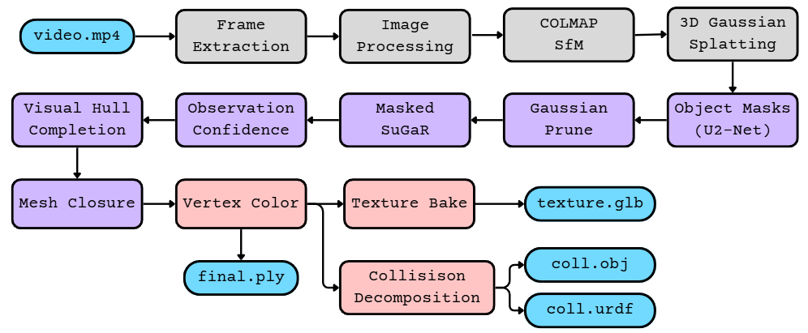
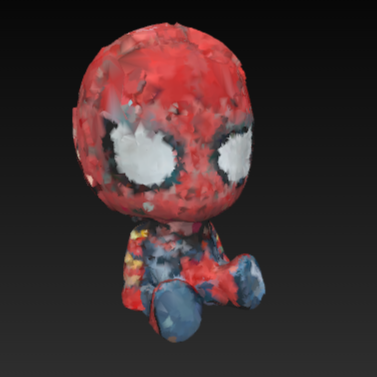
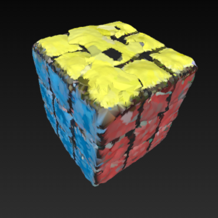
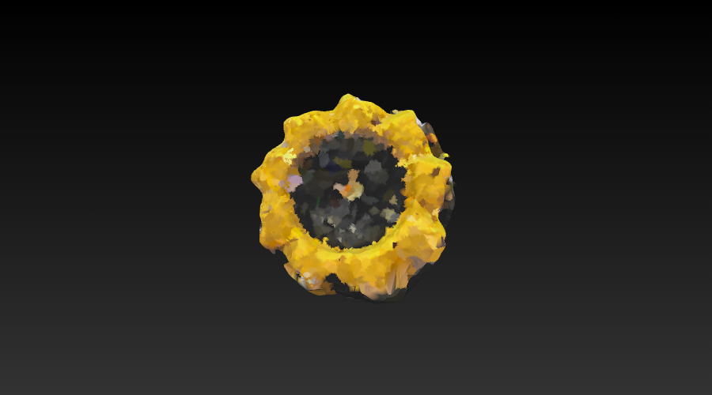

<div align="center">

# SuGaRrush

### Fast SuGaR for object reconstruction



</div>

---

## Abstract

_SuGaRrush turns one hand-held phone video into an isolated, closed, textured and physics-ready
object mesh. The pipeline begins with full-scene COLMAP structure-from-motion and 3D Gaussian
Splatting because the background supplies the feature correspondences and parallax needed for
reliable camera poses. Object isolation is deliberately delayed until those Gaussians have been
trained: U²-Net labels the foreground in every registered view, camera-mask agreement prunes the
scene in Gaussian space, and only the surviving object representation is handed to SuGaR for
surface alignment and Poisson meshing._

_That ordering creates its own failure. SuGaR re-optimizes the pruned Gaussians against the source
images, so an ordinary photometric loss pulls them into spikes, sheets and hooks as they try to
explain the deleted background. SuGaRrush replaces that objective with black-composited
foreground supervision, area-normalized masked loss, an early positional anchor and a focal crop:
the object remains free to explain its observed appearance, but geometry rendered beyond the
silhouette is actively penalized. After meshing, camera-derived observation confidence removes
faces that were never supported; a voted visual hull fills the resulting wound from silhouettes;
MeshFix seals the remaining shell; vertex colour is sampled from the surviving Gaussians; and an
optional texture atlas is rebaked from the original undistorted views. CoACD can then decompose the
closed solid into collision parts and a URDF._

_Nothing in the completion path is generative. U²-Net labels pixels, the visual hull is a
deterministic function of those labels, and unseen regions remain explicitly distinguishable from
measured surface. The implementation was developed on a **4 GB GTX 1650 with 7.7 GB system RAM**:
error-guided SDF sampling reduces SuGaR's one-million-point Monte Carlo budget to 50,000, the image
resolution is derived from measured free VRAM and frame count, and 384 px focal crops spend that
limited budget on the object rather than the surrounding scene._

---

## Results

| | **object6** Spider-Man | **object9** Rubik's Cube | **object3** Glass bowl | **object8** Mecanum wheel |
|:--|:--:|:--:|:--:|:--:|
| surface | glossy painted figure | matte, high-texture | transparent, refractive | painted, concave, repeated rollers |
| registered views | 236 | 499 | 240 | 500 |
| isolation path | masked SuGaR | masked SuGaR | mesh-space carve | masked SuGaR |
| object Gaussians after prune | 25,226 | 48,194 | — | 30,853 |
| final mesh | 116,240 tris | 145,316 tris | 16,308 tris | 139,312 tris |
| final topology | Euler 2 | Euler 2 | Euler −16 | Euler 0 |
| texture coverage | **90.29 %** | 83.86 % | 89.42 % | **90.73 %** |
| texture PSNR | **24.02 dB** | 16.85 dB | 18.42 dB | 17.82 dB |
| measured outcome | closed body; fine costume detail lost | strongest geometry; rounded and pillowed | lumpy partial shell | silhouette recovered; rollers fused |

<div align="center">




<br>
<b>Left → right:</b> Spider-Man · Rubik's Cube · glass bowl · Mecanum wheel.
</div>

**Spider-Man (`object6`).** The pipeline produces a closed figure with the large-scale body and
paint regions intact, but ceiling reflections are baked into the head texture. The crown is pushed
in where the source video loses the top of the head for many views, and the costume web lines and
hands are below the recoverable detail scale at the derived image resolution.

**Rubik's Cube (`object9`).** This is the strongest geometric result: the object is recognizably
cubic, the sticker colours and black separators land in the correct regions, and the final shell has
Euler 2. The reconstruction still has no semantic notion of a cube, so edges are rounded, faces are
slightly pillowed, and a fused lump remains on the yellow face where photometric and silhouette
evidence failed to reject it.

**Glass bowl (`object3`).** Transparency breaks the assumption that a surface point has a
view-consistent appearance: much of the radiance belongs to whatever lies behind the bowl, so 3DGS
has no stable density level set to mesh. The exterior ridges, rim diameter and approximate wall
thickness survive, but the result is lumpy, mostly textureless and topologically noisy, including a
see-through hole.

**Mecanum wheel (`object8`).** The outer diameter, disc silhouette and yellow/black material split
are recovered as a closed solid. The axle through-hole is absent because too few views constrain it,
and the gaps between angled rollers are never empty in the orbit silhouettes—another roller lies
behind them—so visual-hull voting and screened Poisson fuse the rollers into one continuous barrel
mass.

---

## The pipeline

One command, twelve stages, three runtime environments. Every stage writes a `.done_<stage>` marker, so
a re-run resumes from where it stopped rather than recomputing.

| # | Stage | Script / tool | Env | Output |
|:--:|:--|:--|:--:|:--|
| 1 | frames | `select_sharp.py` (ffmpeg + Laplacian) | colmap → sugar | `<scene>/input/` |
| 2 | SfM | COLMAP (exhaustive) | colmap | `<scene>/sparse/0/` poses |
| 3 | 3DGS | `gaussian_splatting/train.py -r 2` | sugar | `output/vanilla_gs/<name>/` |
| 4 | masks | `rembg` U²-Net | seg | `<scene>/masks/` |
| **5** | **Gaussian prune** | **`prune_gaussians.py`** | sugar | `output/pruned_gs/<name>/` |
| **6** | **masked SuGaR** | **`train_full_pipeline.py` + `mask_loss.py`** | sugar | `output/refined_mesh/<name>/*.obj` |
| **7** | **observation confidence (ρ)** | **`observation_confidence.py`** | sugar | `<name>_rhofilt.ply` |
| **7b** | **visual-hull completion** | **`hull_complete.py`** | sugar | `<name>_hullcomp.ply` |
| 8 | cleanup | `clean_mesh_v2.py` | sugar | *(skipped after 7b)* |
| 9 | watertight | `close_mesh.py` (pymeshfix) | sugar | **`output/final/<name>_final.ply`** |
| 9b | TV-normal flatten *(opt-in)* | `tv_normal_patch.py` | sugar | flattened patch |
| 10 | vertex colour | `color_from_gaussians.py` | sugar | per-vertex RGB on `_final.ply` |
| 11 | texture *(opt-in)* | `bake_texture.py` | sugar | `output/final/<name>/visual/` |
| 12 | collision *(opt-in)* | `make_collision.py` (CoACD) | sugar | `output/final/<name>/collision/` |

Stages **5–7b in bold** are this project's additions; their development and implementation are
described in [`docs/notes/Dirac_writeup.pdf`](./docs/notes/Dirac_writeup.pdf). When
`--gaussian-prune` is off, stage 7 uses `carve_mesh.py` to isolate the object in mesh space instead.

---

# Running the pipeline on your system

The launcher uses three isolated conda environments—`sugar`, `colmap`, and `seg`—because changing
COLMAP or ONNX dependencies inside the pinned PyTorch/PyTorch3D environment can break the CUDA
extensions. The checked-in `environment.yml` creates the reconstruction base; the active geometry
extras and the two utility environments must be installed separately as shown below.

<details>
<summary><b>1 · System, GPU and compiler prerequisites</b></summary>

The tested platform is Linux under WSL2 with an NVIDIA GTX 1650 (4 GB VRAM), CUDA 11.8, GCC/G++ 11,
Miniforge and approximately 8 GB system RAM. A newer NVIDIA driver is fine, but the CUDA toolkit
used to compile the extensions must match the PyTorch CUDA 11.8 stack.

Install or provide:

- an NVIDIA driver visible through `nvidia-smi`;
- CUDA toolkit 11.8, including `nvcc`;
- GCC and G++ 11;
- Git with submodule support;
- Miniconda, Miniforge or Mambaforge;
- enough disk space for conda environments, U²-Net weights, scenes and checkpoints.

Verify the toolchain before creating any environment:

```bash
nvidia-smi
/usr/local/cuda-11.8/bin/nvcc --version
gcc-11 --version
conda --version
```

`env.sh` is configured for CUDA 11.8, GCC 11, `MAX_JOBS=2`, and Turing compute capability
`7.5+PTX`. Change `CUDA_HOME`, `CC`, `CXX`, and `TORCH_CUDA_ARCH_LIST` there if your toolkit or GPU
differs. Building for the wrong architecture can surface later as a misleading CUDA out-of-memory
error; excessive parallel compilation can exhaust system RAM.

</details>

<details>
<summary><b>2 · Clone the repository and initialize submodules</b></summary>

```bash
git clone --recursive <repository-url> SuGaR
cd SuGaR
git submodule update --init --recursive
source env.sh
```

Run every remaining command from the repository root. If the repository is already cloned, the
submodule command is still safe and ensures the 3DGS rasterizer and `simple-knn` sources exist.

</details>

<details>
<summary><b>3 · Create the <code>sugar</code> environment and build CUDA extensions</b></summary>

Create the pinned Python 3.9 / PyTorch 2.0.1 / CUDA 11.8 / PyTorch3D 0.7.4 environment:

```bash
source env.sh
conda env create -f environment.yml

conda run -n sugar pip install -e \
  ./gaussian_splatting/submodules/diff-gaussian-rasterization
conda run -n sugar pip install -e \
  ./gaussian_splatting/submodules/simple-knn
```

Install the packages used by the active closure, texture and collision stages:

```bash
conda run -n sugar pip install \
  trimesh==4.12.2 pymeshfix==0.17.2 xatlas==0.0.11 coacd==1.0.11

# Required only for --texture. Clone this dependency if nvdiffrast/ is absent.
git clone https://github.com/NVlabs/nvdiffrast.git
conda run -n sugar pip install ./nvdiffrast
```

Do not clone `nvdiffrast` again when the directory already exists. `python install.py` automates the
base environment and CUDA-extension installation, but it uses unchecked shell return codes; the
explicit commands above make build failures visible.

</details>

<details>
<summary><b>4 · Create the COLMAP/video and U²-Net environments</b></summary>

The `colmap` environment supplies both SfM and ffmpeg. The conda-forge CUDA build is used on the
tested machine; a CPU COLMAP build also works, more slowly.

```bash
conda create -n colmap -c conda-forge colmap ffmpeg -y
```

The `seg` environment supplies rembg's U²-Net session and OpenCV for optional bilateral filtering:

```bash
conda create -n seg -c conda-forge python=3.10 pip -y
conda run -n seg pip install \
  rembg==2.0.69 onnxruntime==1.23.2 opencv-python-headless==5.0.0.93
```

U²-Net weights are downloaded into the rembg cache the first time a session is created. Preload
them while network access is available:

```bash
conda run -n seg python -c \
  "from rembg import new_session; new_session('u2net'); print('U2Net ready')"
```

</details>

<details>
<summary><b>5 · Point the launcher at conda and verify all three environments</b></summary>

`scripts/reconstruct_object.sh` defaults to the conda initialization path used on the development
machine. Override it once per shell when conda lives elsewhere:

```bash
export CONDA_SH="$(conda info --base)/etc/profile.d/conda.sh"
source env.sh
```

Run the smoke checks before committing to a long reconstruction:

```bash
conda run -n colmap colmap -h
conda run -n colmap ffmpeg -version
conda run -n seg python -c "import rembg, cv2; print('seg ready')"
conda run -n sugar python -c \
  "import torch, open3d, trimesh, pymeshfix, xatlas, coacd, nvdiffrast.torch; \
from diff_gaussian_rasterization import GaussianRasterizer; \
from simple_knn import _C; \
print(torch.cuda.get_device_name(0))"
bash -n scripts/reconstruct_object.sh
```

If the CUDA imports fail, rebuild both 3DGS extensions after sourcing `env.sh`; changing only runtime
flags cannot repair an extension compiled for the wrong GPU architecture.

</details>

<details>
<summary><b>6 · Capture and prepare an input video</b></summary>

Put the video under `inputs/`, preferably as a 30–60 second 1080p MP4.

- Orbit the object through a complete 360° azimuth.
- Vary elevation so cameras observe the top and the underside.
- Keep the object centered, fully in frame and reasonably large.
- Use diffuse lighting and a matte, textured subject where possible.
- Avoid motion blur, changing exposure, transparent materials and strong specular reflections.

The visual hull can only preserve structures that affect the silhouettes. A hole hidden from most
views or a gap with another part behind it is likely to be filled, as seen on the Mecanum wheel.

</details>

### Quickstart

```bash
cd SuGaR
export CONDA_SH="$(conda info --base)/etc/profile.d/conda.sh"
bash scripts/reconstruct_object.sh \
  --video inputs/myobject.mp4 \
  --name myobject
```

That runs the conservative default: sharp-frame selection, full-scene COLMAP and 3DGS, U²-Net
masks, full-supervision SuGaR, mesh-space isolation, short refinement and vertex-coloured geometry.

### Recommended full run

```bash
nohup bash scripts/reconstruct_object.sh \
    --video inputs/myobject.mp4 --name myobject \
    --fps 20 --target 400 \
    --gaussian-prune \
    --sdf-samples 50000 --refine long \
    --texture --collision \
    > scenes/myobject_run.log 2>&1 &

tail -f scenes/myobject_run.log
```

This enables Gaussian-space isolation before meshing, error-guided SDF sampling, long refinement,
the observation-only texture atlas and the optional compound-convex collision asset.

**Optional bilateral preprocessing.** Add `--bilateral` to filter only the selected sharp frames
before they enter COLMAP. It is off by default. In the
[`object10` long-refine A/B test](./docs/notes/hard_bilateral_object10_benchmark.md), the hard
setting `d=7, sigmaColor=50, sigmaSpace=3` cut SIFT features by 38.79%, lost two camera
registrations, reduced 3DGS PSNR by 0.918 dB and lowered texture coverage by 7.37 percentage points.
The final geometry remained close, but there was no overall quality gain, so the hard setting is
not recommended as a global default.

### Resume or rerun a stage

Every stage writes `scenes/<name>/.done_<stage>`. Repeating the same command resumes from the first
unfinished stage. To rerun from masked SuGaR onward while keeping COLMAP and 3DGS cached, remove only
the downstream markers:

```bash
rm -f scenes/myobject/.done_sugar_gp scenes/myobject/.done_rhofilter \
      scenes/myobject/.done_hullcomplete scenes/myobject/.done_texture_gp \
      scenes/myobject/.done_collision
bash scripts/reconstruct_object.sh \
  --video inputs/myobject.mp4 --name myobject \
  --gaussian-prune --sdf-samples 50000 --refine long --texture --collision
```

Use `--force` to ignore every marker. A changed frame-stage option such as `--fps`, `--target`, or
`--bilateral` has no effect while `.done_frames` exists; use a new object name or rerun the whole
pipeline with `--force`.

### Choosing parameters

| If your object is… | then… |
|:--|:--|
| compact and matte (cube, box, figurine) | add `--gaussian-prune`; the default support and agreement gates are appropriate |
| **thin or spindly** (frames, spokes, wires) | lower `--rho-keep-ratio` toward `0.3`; visual-hull completion can still fuse or remove thin parts |
| **high-genus** (perforated, holed) | inspect the rho mesh and consider pinning `--gp-poisson-depth 7` or `8` |
| small in frame | keep `--focal-crop` on and increase `--target` only if VRAM permits |
| glossy or transparent | expect partial recovery; more frames do not remove view-dependent appearance |
| captured in clutter | use `--gaussian-prune` so support and silhouette agreement reject the scene |

### Long unattended runs

The development machine has only 7.7 GB system RAM. For multi-hour runs, log stdout/stderr, monitor
`MemAvailable` and keep other GPU workloads closed. A process-level failure leaves resumable stage
markers and logs; exhausting the host or WSL VM may not.

---

## Parameter reference

`scripts/reconstruct_object.sh`. Every flag has a working default; only `--video` is required.

### Input and framing

| Flag | Default | Meaning |
|:--|:--:|:--|
| `--video` | — | **required** — input video |
| `--name` | video basename | scene name under `scenes/` |
| `--fps` | `10` | extraction rate *before* sharpness filtering. Over-extract: `select_sharp.py` keeps the sharpest frame per sliding window, so a higher fps only improves the choice |
| `--target` | `240` | sharp frames to keep. More frames improve hull coverage but lower the VRAM-derived SuGaR resolution |
| `--gs-iters` | `7000` | vanilla 3DGS iterations |
| `--bilateral` | off | bilateral-filter selected frames before they enter the scene directory |
| `--bilateral-diameter` | `3` | positive odd OpenCV filter-neighborhood diameter |
| `--bilateral-sigma-color` | `10` | color sigma in 8-bit intensity levels |
| `--bilateral-sigma-space` | `1` | spatial sigma in pixels |
| `--bilateral-jpeg-quality` | `95` | JPEG quality for filtered selected frames |

### Gaussian-space isolation and masked SuGaR

| Flag | Default | Meaning |
|:--|:--:|:--|
| `--gaussian-prune` | off | **isolate in Gaussian space** and train SuGaR masked, instead of the mesh-space carve |
| `--prune-keep-ratio` | `0.6` | agreement test: fraction of framing views that must see the centre inside the silhouette |
| `--prune-min-support` | `0` (auto) | support test: fraction of *all* views in which a centre must be in frame. `0` calibrates from the empty band |
| `--prune-min-views` | `8` | absolute floor on framing views |
| `--mask-loss-weight` | `1.0` | global multiplier on the area-normalized masked L1 |
| `--ssim-erode` | `5` | px eroded from the mask before the SSIM term |
| `--anchor-lambda` | `0.2` | L2 tether to pruned positions (prevents topology tearing) |
| `--focal-crop` / `--no-focal-crop` | on | crop the frame to the object (~4× object resolution) |
| `--focal-size` | `384` | focal crop side in px |
| `--gp-poisson-depth` | `auto` | octree depth, or `auto` to search by measured topology |
| `--refine` | `short` | SuGaR refinement: `short` (2k) / `medium` (7k) / `long` (15k iters) |
| `--vertices` | `500000` | foreground vertex budget |

### SDF sampling and refinement

| Flag | Default | Meaning |
|:--|:--:|:--|
| `--sdf-samples` | `50000` | Monte-Carlo SDF sample count. Upstream is 1,000,000; cost is ~linear in this |
| `--no-error-guided` | off | disable error-guided sampling (uniform budget) |
| `--error-mix` | `0.5` | fraction of the budget chasing high-residual regions |

### Post-extraction (stages 7–12)

| Flag | Default | Meaning |
|:--|:--:|:--|
| `--rho-keep-ratio` | `0.75` | ρ's visual-hull agreement test. **Lower toward 0.3 for thin structures**, accepting weaker rejection of fused geometry |
| `--hull-grid` | `256` | hull carve voxel grid per axis. Carve time scales ~N³ |
| `--hull-target-faces` | `150000` | decimation target for the completed mesh |
| `--keep-ratio` | `0.85` | mesh-space carve threshold (default path only) |
| `--tv-flatten` / `--no-tv-flatten` | off | TV-normal flattening of the completed patch |
| `--tv-iters` | `40` | TV flattening iterations |
| `--no-vertex-color` | off | skip baking per-vertex RGB |

### Output assets

| Flag | Default | Meaning |
|:--|:--:|:--|
| `--texture` | off | bake an observation-only texture atlas |
| `--atlas` | `2048` | atlas side in px |
| `--tex-views` | `24` | top-K observations per texel for the weighted median |
| `--collision` | off | CoACD convex decomposition → collision OBJ + URDF |
| `--coacd-threshold` | `0.05` | concavity threshold (higher → fewer, coarser hulls) |
| `--force` | off | ignore `.done` markers and recompute everything |

---

## After mesh extraction — stages 7 to 12

SuGaR hands over a mesh that is *photometrically* good but makes no distinction between surface the
cameras measured and surface that merely accumulated where nothing was observed. These stages
establish that distinction, close the result, and turn it into usable assets.

### Stage 7 · Observation confidence (ρ)

`observation_confidence.py` computes a per-face confidence from the actual cameras and masks, and
drops what was never seen. **The pipeline had been treating every extracted surface point as
evidence, and that is the root of the "bulge"**: in a region no camera saw, nothing constrains the
Gaussians, junk accumulates, and Poisson fits that junk with the same weight as a face seen 300
times.

On the Rubik's Cube run, ρ pruning retained 59,469 of 78,642 refined faces. About 3.07% of faces
were never supported by any registered camera, while the median face support was 0.713.

Three things this stage had to get right:

- **Visibility must be a z-buffer test, not a frustum test.** A floater tucked against the silhouette
  passes a frustum test from many views. Occlusion *is* the discriminator. The depth buffer is
  cropped to the object's projected bbox and resolved so faces are not sub-pixel.
- **Incidence must use `|⟨n,d⟩|`, not the clamped `⟨n,d⟩₊`.** SuGaR's winding is unreliable (~90 % of
  face normals point inward here), so the clamp zeroed nearly every real observation — the first run
  gave median ρ = 0.000.
- **ρ must be iterated, and the occluder set may only shrink.** Junk in front of a corner makes the
  corner read as never-seen; removing an occluder *is* a new observation. Feeding back the visible set
  oscillates (67,971 → 72,613 → 68,422), so use "everything except junk" and let junk only grow.

**Never recompute ρ after closure** — the invented patch is the outermost surface, so every camera
"sees" it and it certifies itself as observed. Provenance must be carried *through* the closure.

### Stage 7b · Visual-hull completion

ρ leaves the mesh honest but **open**, and what fills that wound decides the result. Every filler
that reasons from a prior instead of from the data failed, each in the way its own energy predicts:

| filler | what it minimizes | what it produced |
|:--|:--|:--|
| Poisson re-fit | smooth energy | a **dome** |
| pymeshfix on a big non-planar rim | triangulation | a folded **tent** |
| least-squares planar cap | one plane through the rim | a **plate** carrying 23.7 % of surface area, slicing a corner off |

The planar cap's bug was a missing admissibility check, not a coding error: the wound rim spans 85 %
of the object diagonal with planarity deviation 0.1387 against ~0.005 for a real face. **No single
plane exists.**

`hull_complete.py` instead fills with the **visual hull**, which is a *deterministic function of the
observations* — so it adds nothing the cameras did not supply. Space-carve occupancy from dilated
masks → boundary voxels as oriented samples → keep only those farther than τ from the measured
surface → one screened Poisson over measured ∪ wound → **snap observed vertices back**.

Two design points that were learned the hard way:

- **Carve by vote, not by strict intersection.** A textbook visual hull dies the moment one view calls
  a voxel background, which makes it maximally fragile to segmentation error. On object6 the upper
  body had 0.924 median agreement over 118 views, yet strict intersection deleted it. Out-of-frame is
  **not** dissent, which keeps the hull a conservative outer bound.
- **The tolerance is calibrated, not guessed.** `calibrate_dissent()` samples the known-real measured
  surface and takes p95 of its dissent × 1.5. Hand-setting failed in both directions: 0 deleted a real
  upper body, a borrowed 0.25 inflated the hull 21.7 % in Z.

For the Rubik's Cube, completion fused the 59,469 supported input faces into a single 150k-face
shell. About 28.57% of the completed surface was synthesized rather than directly observed; the
p99 deviation over the observed region was 0.01345 scene units.

### Stage 8 · Feature-preserving cleanup

`clean_mesh_v2.py` — component filtering and *rim/crease-frozen* smoothing only. The standard
point-cloud recipe (statistical outlier removal, isotropic smoothing) erodes exactly the thin plates
and rims that matter. **Automatically skipped after stage 7b**, which already produces a clean single
shell — running it there opened 305 boundary edges and drove euler to −132.

### Stage 9 · Watertight closure

`close_mesh.py` runs **pymeshfix** (Attene's MeshFix) to seal the mesh into a manifold with valid
volume and inertia.

**pymeshfix repairs by *deleting*, so its damage scales with the topological junk it is handed.** On
a genus-613 input it removed **8.5 % of the object** — two axes shrank ~20 %, and the "watertight
solid" enclosed 0.086 where the true solid is ~0.28. Feeding it a clean single shell from 7b is what
makes it safe.

Two things to know when reading its report:

- `o3d.is_watertight()` also forbids self-intersection, so a perfectly closed, orientable shell
  (0 boundary edges, euler 2, edge- and vertex-manifold) still reports `False`. **Don't chase it.**
  What volume and inertia need is *closed + orientable*.
- **Diagnose repairs by enclosed volume**, not by the watertight flag — divergence-theorem volume is
  what exposed the carved shell instantly.

### Stage 9b · TV-normal flattening *(opt-in)*

An ℓ1 penalty on dihedral angle has piecewise-constant minimizers — a flat face rather than a dome.
The principle is right, but the implementation moves vertices with **no self-intersection guard**, so
it breaks exact watertightness while buying ~1 % of TV(n). Opt-in via `--tv-flatten` until it has one.

### Stage 10 · Vertex colour

`color_from_gaussians.py` samples the surviving Gaussians' spherical harmonics and bakes per-vertex
RGB onto `_final.ply`. Always on unless `--no-vertex-color`.

### Stage 11 · Texture bake *(`--texture`)*

`bake_texture.py` unwraps with `xatlas`, rasterizes the atlas in UV space, and projects the source
frames onto the mesh — blending with a **weighted median** rather than a mean. A mean smears a
specular highlight, seen in only a few of the ~70 views per texel, into a ghost across the surface;
the median rejects it, giving partial de-lighting for free.

Per camera it rejects occluded texels (depth z-test), out-of-mask texels, and grazing views
(`|dot(n,v)| < 0.2`), keeping the top K observations per texel.

| object | atlas | cameras | coverage | mean views/texel | **in-mask PSNR** |
|:--|:--:|--:|--:|--:|--:|
| object6 — Spider-Man | 2048² | 236 | 90.29% | 66.16 | **24.02 dB** |
| object9 — Rubik's Cube | 2048² | 499 | 83.86% | 183.53 | 16.85 dB |
| object3 — Glass Bowl | 2048² | 240 | 89.42% | 73.38 | 18.42 dB |
| object8 — Mecanum Wheel | 2048² | 500 | 90.73% | 130.70 | 17.82 dB |

Coverage is reported honestly in `<name>_texbake.json`, and correctness is checked by re-rendering
the baked mesh against GT inside the mask.

> **Coverage measures visibility, not correctness.** Completed regions that no camera observed
> receive fallback colors, and high coverage can coexist with rounded geometry, fused gaps, baked
> reflections, or other reconstruction errors.

### Stage 12 · Collision asset *(`--collision`)*

`make_collision.py` runs **CoACD** convex decomposition on the watertight mesh and emits a
compound-convex `.obj` plus a `.urdf` with per-part collisions and inertia computed from the solid —
ready for MuJoCo, PyBullet or Isaac. Purely algorithmic; invents no geometry.

Part count is a useful sanity signal: **Spider-Man → 41 parts** at concavity 0.02. Spikes or floaters
upstream can cause CoACD to create many tiny hulls; a part explosion means the geometry upstream is
wrong.

---

## Outputs

```
scenes/<name>/
  input/            sharpness-filtered frames
  images/           undistorted images (COLMAP)
  sparse/0/         COLMAP poses + sparse cloud
  masks/            U²-Net object silhouettes
  logs/             per-stage logs
  .done_*           resume markers

output/
  vanilla_gs/<name>/                7k-iter 3DGS checkpoint (full scene)
  pruned_gs/<name>/                 object-only Gaussians        (--gaussian-prune)
  coarse/, coarse_mesh/, refined/   SuGaR intermediates
  refined_mesh/<name>/*.obj + .png  SuGaR textured mesh
  final/
    <name>_final.ply        ★       watertight, vertex-coloured mesh   ← main deliverable
    <name>_rhofilt.ply              ρ-filtered mesh (measured surface only, open)
    <name>_hullcomp.ply             hull-completed mesh (pre-closure)
    <name>_prune.json               prune report: σ, band, per-test counts
    <name>_rho.json                 ρ report: observed/wound split, κ
    <name>_hull.json                hull report: invented fraction, deviation
    <name>_watertight.json          topology before/after closure
    <name>/visual/                  textured asset            (--texture)
      <name>_textured.glb, _texture.png, _textured_obj/, _texbake.json, _colored.glb
    <name>/collision/               physics asset             (--collision)
      <name>_collision.obj, _collision_part{0..N}.obj, <name>.urdf, _collision.json
```

**If a run disappoints, read `_rhofilt.ply` before `_final.ply`.** They separate *what the cameras
measured* from *what the closure invented*, and that is almost always where the answer is.

---

## Honest limitations

These are measured ceilings, not aspirations.

- **Transparent and reflective materials remain ill-posed.** The Glass Bowl's view-dependent
  appearance violates the stable-surface-color assumption used by Gaussian optimization and texture
  projection, producing a lumpy, nearly textureless surface even when its rim and ridges remain
  plausible.
- **Silhouettes cannot reveal persistently occupied concavities.** For the Mecanum Wheel, roller gaps
  were fused and the axle opening disappeared because those image regions were usually occupied from
  the captured viewpoints.
- **Thin or incompletely observed structures disappear easily.** Spider-Man's fine webbing, fingers,
  and out-of-frame crown geometry are vulnerable to segmentation, ρ pruning, low-resolution
  silhouettes, and completion.
- **Completion necessarily invents hidden geometry.** Visual-hull fusion closes wounds and supplies
  watertight volume, but unsupported regions are constrained by silhouettes rather than measured
  surface evidence.
- **Poisson reconstruction smooths sharp edges.** The error-guided sampler concentrates points near
  discrepancies, but it cannot make Poisson intrinsically edge-preserving; the Rubik's Cube therefore
  becomes rounded or pillowed.
- **Automatic genus selection is heuristic.** It uses the Euler characteristic of the measured mesh
  as a proxy, which is useful but not guaranteed to recover the true topology of mechanically complex
  objects.
- **Coverage and PSNR are insufficient asset-quality metrics.** Inspect the mesh render, Euler
  characteristic, enclosed volume, texture artifacts, and collision-part count together.

---

## Environments

Three active environments, created once and deliberately isolated so no stage's dependencies can
perturb the pinned `torch 2.0.1 + pytorch3d 0.7.4` stack SuGaR requires.

| Env | Purpose | Key pins |
|:--:|:--|:--|
| `sugar` | reconstruction + geometry | python 3.9, torch 2.0.1/cu118, pytorch3d 0.7.4, Open3D, xatlas, trimesh, pymeshfix, coacd, `TORCH_CUDA_ARCH_LIST=7.5+PTX` |
| `colmap` | SfM + video | COLMAP 3.13 (CUDA build), ffmpeg |
| `seg` | object masks | rembg / U²-Net (onnxruntime) |

The repository may still contain a legacy `cad` environment, but `reconstruct_object.sh` does not
activate it.

Two failure modes on this hardware masquerade as memory errors and are worth knowing:

- **Wrong CUDA arch.** Building the CUDA extensions for the wrong architecture produces binaries with
  no loadable kernel image, and it surfaces as a *misleading*
  `std::bad_alloc: cudaErrorMemoryAllocation: out of memory` from `simple-knn`. No amount of memory
  tuning fixes it. Check with `cuobjdump <_C.so> | grep arch`.
- **Build parallelism.** `nvcc` peaks at 2–3 GB per translation unit; the default `nproc` OOMs the
  machine. Use `MAX_JOBS=2`.

COLMAP lives in its own environment on purpose: installing it into `sugar` lets the solver move
numpy/BLAS and break the pinned torch stack. It is only ever invoked as an external binary.

---

## Script reference

| Script | Purpose |
|:--|:--|
| `reconstruct_object.sh` | end-to-end video → watertight isolated mesh (all 12 stages) |
| `select_sharp.py` | keep the sharpest frame per sliding window |
| **`prune_gaussians.py`** | **Gaussian-space isolation: agreement + calibrated support gate** |
| **`sugar_utils/mask_loss.py`** | **area-normalized masked L1 + eroded-mask SSIM** |
| **`observation_confidence.py`** | **per-face ρ from cameras + masks; drops never-seen geometry** |
| **`hull_complete.py`** | **visual-hull completion of the wound (vote carve + calibrated tolerance)** |
| `carve_mesh.py` | mesh-space visual-hull carve (default path); also supplies camera math |
| `clean_mesh_v2.py` | feature-preserving cleanup (rim/crease-frozen smoothing) |
| `close_mesh.py` | pymeshfix watertight closure |
| `tv_normal_patch.py` | TV-normal flattening of the completed patch (opt-in) |
| `color_from_gaussians.py` | per-vertex RGB from the surviving Gaussians (SH → colour) |
| `bake_texture.py` | weighted-median observation-only texture atlas |
| `make_collision.py` | CoACD convex decomposition → collision OBJ + URDF |
| `view_ply.py` | type-aware `.ply` viewer (Gaussian cloud vs mesh) |
| `clean_mesh.py` | v1 cleanup (superseded; kept for reference) |

---

<div align="center">

Built on top of <a href="https://github.com/Anttwo/SuGaR">SuGaR (Guédon &amp; Lepetit, CVPR 2024)</a>.<br>
SDF optimization write-up: <a href="./docs/notes/optimization_report.md">optimization_report.md</a> ·
Pipeline engineering log: <a href="./docs/notes/3dReconstruction.md">3dReconstruction.md</a> ·
Completion theory: <a href="./docs/notes/morphogenetic_completion.md">morphogenetic_completion.md</a>

</div>
